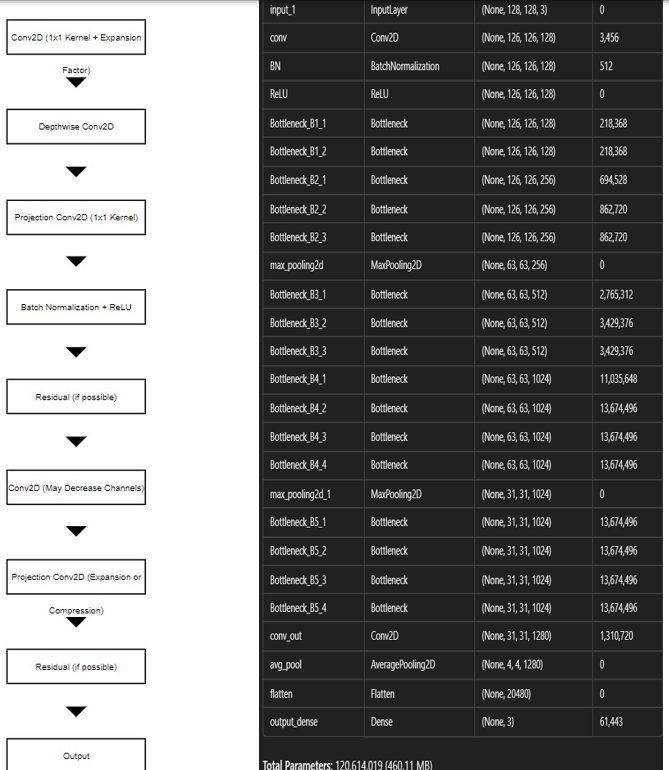

# TypicalNet

## Custom CNN Classifier for Edge Devices

This repository contains a lightweight custom **CNN (Convolutional Neural Network)** classifier built using **Keras**. It is designed for deployment on edge devices such as IoT devices, mobile phones, or embedded systems where computational resources are limited.

---

## Model Overview

The model leverages **Depthwise Convolutions** and a **Bottleneck Block** architecture to optimize performance while minimizing computational cost. This approach is inspired by efficient architectures like **MobileNet** and other lightweight models tailored for edge deployments.

---

## Key Features

- **Depthwise Separable Convolutions**: Reduces the number of parameters and computations compared to standard convolutions.
- **Bottleneck Blocks**: Efficiently compresses and expands channels to maintain performance with minimal overhead.
- **Residual Connections**: Helps with gradient flow and mitigates the vanishing gradient problem in deep networks.
- **Parameter Efficiency**: Only ~12.6M parameters, making it suitable for edge devices.
- **Balanced Design**: Gradually decreases the spatial dimensions while increasing the number of filters for optimal feature extraction.

---

## Suggestions or Feedback?

I'd love to hear from you! If you have any suggestions, improvements, or issues, feel free to:

- Open an issue on this repository.

